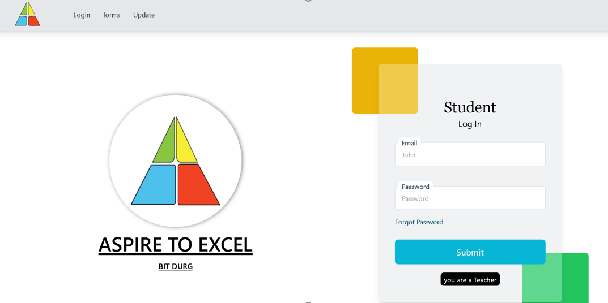
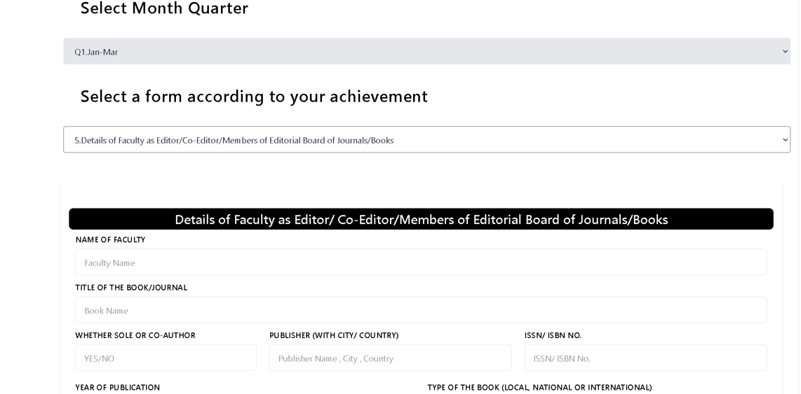
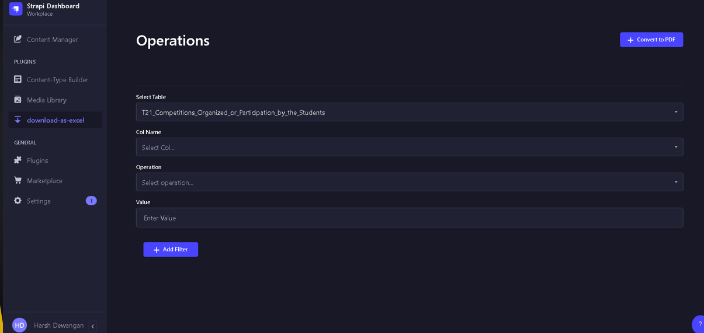

# Quarterly Report Management System(QRMS)

Quarterly Report Management System (QRMS) is a web-based application designed to streamline the process of collecting, managing, and analyzing quarterly reports for college events.

## Technology Used :
* Next.js 
* Tailwind Css 
* Strapi 
* JavaScript 
* Node.js 
* PostgreSQL

## Images:

<!-- [Link to the Project](https://vmartfrontend.onrender.com/ "V-Mart") -->

